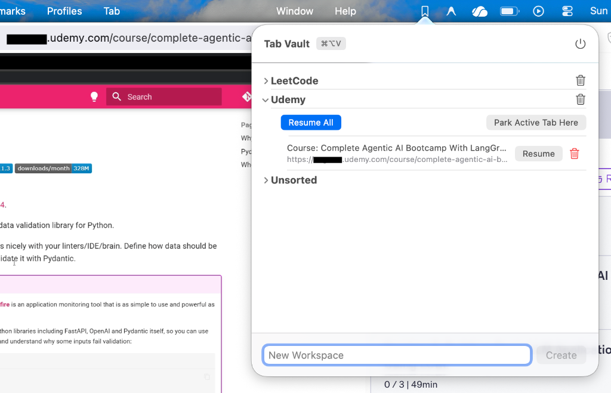

# Tab Vault 🔖

## The Problem
As developers, students, and researchers, we constantly suffer from "tab fatigue." We leave dozens of tabs open across multiple browsers (Chrome, Brave, Safari) because we are afraid of losing our context. Keeping these tabs open indefinitely drains Mac memory (RAM), hogs CPU cycles, and kills battery life. 

Traditional bookmark managers are too slow and clunky for temporary tasks, and heavy "read-it-later" apps break our immediate workflow. There is a missing middle ground for tabs that you don't need *right now*, but definitely need *later today*.

## The Solution
**Tab Vault** is a lightning-fast, native macOS menu bar utility designed to cure tab clutter. 

It allows you to instantly "park" your active browser tab into custom workspaces (e.g., "LeetCode", "Research", "Documentation") using a global system hotkey (`⌘⌥V`). By parking tabs, you can safely close them in your browser, saving massive amounts of system resources, while knowing they are securely stored for 1-click resumption.

### Key Features
- **Cross-Browser Intelligence:** Seamlessly detects and extracts URLs from Safari, Google Chrome, and Brave.
- **Global Hotkey:** Press `⌘⌥V` from anywhere on your Mac to instantly pop open the vault.
- **Native & Lightweight:** Built in pure Swift/SwiftUI. It consumes ~25MB of RAM, whereas a single open Chrome tab can consume 500MB+.
- **Auto-Start:** Integrates directly into macOS Login Items to run silently in the background on boot.

## ⚙️ System Requirements
- **OS:** macOS 13.0 (Ventura) or later.
- **Supported Browsers:** Safari, Google Chrome, Brave Browser.
- *(Note: Tab Vault uses native Apple Events to securely communicate with your browser. When you run it for the first time, macOS will ask for permission to control your browser.)*

## 🚀 How to Use
1. **Launch the App:** Open Tab Vault. You will see a small Bookmark icon appear in your Mac's top Menu Bar.
2. **Pop the Vault:** While browsing the web, press **`⌘⌥V`** (Command + Option + V) to instantly open the vault menu.
3. **Create a Workspace:** Type a category name (e.g., "LeetCode", "Reading List", "Project X") and press Enter to create a new Workspace.
4. **Park a Tab:** Click the **"Park Active Tab Here"** button under your desired workspace. The app will securely save the link and title.
5. **Resume:** Whenever you are ready to pick up where you left off, open the vault and click **"Re-open"** next to your parked tab!

## 🛠️ How to Build (For Developers)
This project uses [XcodeGen](https://github.com/yonaskolb/XcodeGen) to manage the Xcode project file.
1. Clone the repository.
2. Run `xcodegen generate` in the root directory.
3. Open `TabVault.xcodeproj` in Xcode 14+ and hit Run (`⌘R`).

## 🤖 Built with AI
This entire application was pair-programmed and built from scratch with the help of **Google Gemini** (Advanced Agentic Coding). From designing the native macOS architecture and SQLite database to writing the custom AppleScript browser integrations and App Sandbox rules, Tab Vault serves as a showcase of what AI-assisted software engineering can accomplish!
